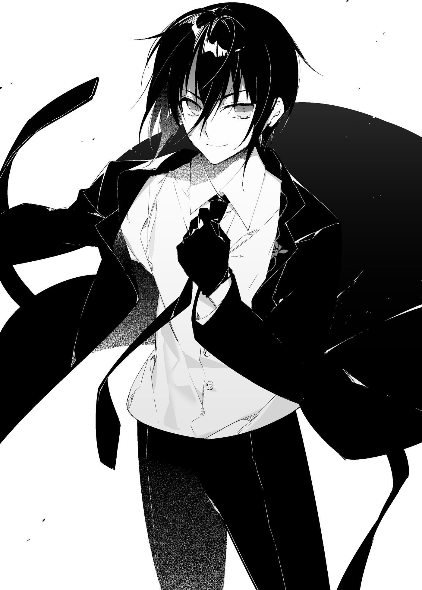

...như thể tất cả những chuyện này là hoàn toàn bình thường.

"Ngươi là...?"

"Ngài Suimei!"

Dường như Công tước Hadorious rốt cuộc cũng không nhận ra Suimei. Manh mối rằng cậu là bạn của Reiji dường như cũng chẳng gợi lên chút ký ức nào, nhưng khi Felmenia gọi tên cậu, vẻ mặt của Hadorious bỗng trở nên khá bối rối.

"Suimei...? Yakagi Suimei? Sao ngươi lại ở đây?"

"Sao ư? Còn vì gì nữa chứ? Tôi đến để giải cứu anh hùng đây."

Nghe thấy những lời đó, một nếp nhăn sâu hoắm hằn lên giữa hai đầu lông mày của Hadorious. Thoáng một khoảnh khắc không thể tin nổi khi nghĩ đến việc Suimei đã thâm nhập vào dinh thự của mình, nhưng điều đó cũng là dễ hiểu. Ông ta hầu như chẳng biết bí thuật của Suimei có thể làm được những gì.

"Ra là vậy... Tên anh hùng chỉ là mồi nhử để ngươi lẻn vào dinh thự sao? Là thế phải không? Ta phải nói rằng, ta thực sự ngạc nhiên khi ngươi có thể vượt qua toàn bộ hệ thống phòng thủ của ta đấy."

"À ừ, thực ra thì chuyện đó cũng chẳng khó khăn gì cho lắm."

Nói đoạn, Suimei bật cười ngẫu hứng. Thái độ dửng dưng vô tư lự của cậu trước sự gián đoạn này dường như càng khiến Hadorious thêm phần bực bội. Bầu không khí mất hứng đã biến vẻ mặt đầy tự tin của ông ta thành một cái cau mày khó chịu.

"Dẫu vậy, ta sẽ không để ngươi cản trở trận đấu giữa ta và Anh hùng-dono đâu. Làm ơn bước sang một bên đi."

"Ô kìa, đừng lạnh lùng thế chứ. Cho tôi nhập cuộc vui với nào. Ông là một đại quý tộc tai to mặt lớn mà, đúng không? Thể hiện lòng hiếu khách của một công tước chút đi chứ, được không hả?"

"Ta chẳng có gì để phô diễn trước một kẻ hạ đẳng như ngươi cả. Tiểu đội hai! Lên phía trước!"

Hadorious lớn tiếng hạ lệnh cho đám tư binh đang giao tranh với Felmenia và Lefille. Một phần trong số chúng tách khỏi cuộc chiến và tiến về phía Suimei. Đáp lại điều đó, Suimei thở dài ngao ngán như thường lệ, nhún vai một cách đầy khoa trương... rồi bắt đầu bẻ các khớp ngón tay răng rắc.

"Chà chà, gọi tôi là kẻ hạ đẳng cơ à? Nghe cay nghiệt thật đấy ông bạn. Chắc tôi sắp khóc mất thôi. Ý tôi là, lỗi của tôi. Xin lỗi vì tôi có một gương mặt quá đỗi tầm thường nhé..."

"Suimei, giờ không phải lúc đùa đâu! Hãy cẩn—"

"Thôi nào, ở đây chẳng có gì khiến tớ phải căng thẳng cả."

Ngay cả trước những tên lính đang ập tới gần, ngay cả khi Reiji cố gắng cảnh báo, Suimei chỉ đơn giản nở một nụ cười toe toét như thể sắp được chơi đùa một trận thỏa thích. Đó không phải là một nụ cười vui vẻ, mà là một nụ cười không chút sợ hãi. Cậu đang nhếch mép giễu cợt những kẻ dám cả gan thách thức mình. Reiji đã từng nhìn thấy ánh mắt đó trước đây và cậu biết nó có ý nghĩa gì—những kẻ này sắp sửa phải nhận một bài học nhớ đời.

Một tia chớp rực sáng bỗng lóe lên sau lưng Suimei như một đòn sấm sét, tạo ra luồng ánh sáng màu xanh thẫm chói lọi trong chớp mắt. Đó là một dàn trận pháp bí thuật cỡ nhỏ đang xếp hàng một cách có trật tự ngay phía sau lưng cậu.

"Cái—?!"

"Đây là...!"

Những tiếng thốt lên kinh ngạc đầy đồng thanh đó lần lượt phát ra từ Reiji và Hadorious. Cả hai người đều sững sờ khi nhìn thấy khoảng năm mươi vòng tròn ma thuật phía sau Suimei, mỗi vòng tròn đều khắc những phương trình thuật thức dị thường... và mỗi vòng tròn đều đang tập hợp ma lực như một khẩu pháo laser đang nạp năng lượng. Thực sự, với toàn bộ chúng được dàn trận sau lưng, Suimei trông hệt như một xạ thủ ma thuật sở hữu một kho vũ khí đồ sộ. Tất cả những gì cậu cần làm chỉ là bóp cò súng—hay trong trường hợp này, là xướng lên câu thần chú ma thuật.

"Illustre carmen ad operationem simplicem. Armat ad quinquaginta et passive diducit, invocato Augoeides. Strategic Bombing."

[Câu chú huy hoàng với quy trình giản lược. Vũ trang từ một đến năm mươi và triển khai ngẫu nhiên, triệu gọi Augoeides. Oanh Kích Chiến Lược (Strategic Bombing).]

Khoảnh khắc cậu kết thúc câu xướng âm và vung mạnh cánh tay xuống, dự cảm của Reiji đã biến thành hiện thực. Các trận pháp bí thuật hội tụ ánh sáng và năm mươi luồng tia sáng rực rỡ đồng loạt bắn ra, lao vun vút về phía những tên lính đang tiếp cận Suimei. Không giống như thứ ánh sáng trong trẻo, dịu nhẹ của đèn pin hay đuốc lửa, những tia sáng này trông như những cột trụ đậm đặc hay những ngọn giáo chập chờn. Reiji thậm chí chẳng cần phải tưởng tượng xem điều gì sẽ xảy ra với kẻ nào bị một trong số chúng đánh trúng.

Ngay khi các chùm tia va chạm, một màn trình diễn ánh sáng chói lọi bùng nổ. Đội hình của đám lính đánh thuê biến thành vũ đài của những vụ nổ và tia lửa bắn tung tóe khắp mọi hướng. Thậm chí thật khó để có thể nhận biết được chuyện gì đang diễn ra bên dưới mớ hỗn độn đó.

Cảnh tượng kinh hoàng khiến sống lưng Reiji lạnh toát. Cậu cảm thấy như mình bị đóng băng tại chỗ—không dám nhúc nhích. Và điều đó hoàn toàn có lợi cho cậu. Nếu bất cẩn bước lên phía trước, cậu cũng có thể bị cuốn vào làn mưa chớp sáng và tia lửa không ngớt này. Tốt nhất là cậu nên đứng yên một chỗ.

Khi cơn hỗn loạn bắt đầu lắng xuống, nó để lại một dư ảnh trong mắt tất cả những ai chứng kiến hệt như ánh đèn chớp đang mờ dần. Mất vài giây họ mới có thể nhìn thấy toàn bộ binh lính trong đội hình lúc này đều đã ngã gục ngay tại chỗ.

Chúng không có vết thương rõ ràng ngoài da, nhưng áo giáp của chúng đã bị thiêu cháy và vỡ vụn. Quá đỗi rõ ràng là chúng đã bị tấn công bởi một uy lực kinh hồn và rực lửa. Không mảy may bận tâm đến những tên lính ngã gục thậm chí còn chẳng buồn co giật, Suimei hướng một nụ cười không chút sợ hãi đầy khiêu khích về phía những tên lính đánh thuê còn lại. Rồi cậu chìa một tay ra và ngoắc ngón tay về phía mình như muốn nói: "Nhào vô kiếm ăn đi."

Thế nhưng tất cả những gì đám lính đánh thuê còn lại đọc được từ thái độ ngạo nghễ của cậu là: "Các người toàn là lũ vô dụng. Ta chẳng quan tâm các người đông đến mức nào—các người không thắng nổi ta đâu." Bị xúc phạm và tức giận đến tột cùng là điều dễ hiểu, tất cả bọn chúng đồng loạt xông vào cậu. Chúng nhanh chóng áp sát, đâm kiếm và giáo về phía Suimei. Đáp lại, cậu chỉ đơn giản bật nhảy lên không trung để né tránh những mũi kiếm giáo của chúng... rồi búng ngón tay một cái.

Đó là một cử chỉ nhẹ nhàng và tao nhã. Và ngay khi tiếng búng tay vang lên giữa không trung, chính bầu không khí trước mặt cậu đã phát nổ dữ dội, thổi bay toàn bộ đám lính đánh thuê. Suimei sau đó đáp xuống một cách liều lĩnh và táo bạo ngay giữa đội hình của chúng. Cậu khom người xuống, đặt bàn tay phải lên những phiến đá lát sân vườn và giải phóng một lượng ma lực khổng lồ cùng một lúc.

Ma lực thuần khiết tự nó mang sức mạnh riêng, nhưng khi không được chuyển hóa thành thuật thức bí thuật, nó không phải là một đòn tấn công đặc biệt hiệu quả. Dẫu vậy, khi một lượng ma lực đủ lớn được giải phóng, ngay cả những huyền bí xung quanh cũng sẽ trở nên cuồng loạn, và đó chính xác là những gì đã xảy ra ở đây. Ma lực của Suimei đã nén năng lượng aetheric trong bầu khí quyển đến mức cực hạn, gây ra một vụ nổ kinh hoàng.

Dĩ nhiên, Reiji không hiểu chuyện gì đang xảy ra. Tất cả những gì cậu thấy là một luồng lửa bùng nổ nuốt chửng cả đám lính lẫn Suimei. Cuối cùng, ngọn lửa và khói bụi tan biến, bị một cơn gió phi tự nhiên thổi bạt đi. Hiện ra thay vào đó... là một ma thuật sư lúc này đang nổi bật trong bộ trang phục màu đen. Cậu vung tay như thể đang xua đuổi tàn lửa còn sót lại như xua ruồi và thở dài đầy vẻ chán chường.

Thế này là...

Reiji sững sờ trước cảnh tượng tàn phá kinh hoàng mà mình vừa chứng kiến, và thậm chí còn kinh ngạc hơn nữa trước người bạn thân nhất đã gây ra nó. Tất cả những điều đó, đến từng chi tiết nhỏ nhất, đều vượt xa trí tưởng tượng của cậu. Cậu đã từng choáng váng khi nhìn thấy Felmenia sử dụng ma thuật, nhưng cảnh tượng này thậm chí còn vượt xa điều đó gấp bội lần.

Khi Reiji lần đầu nghe nói về các ma thuật sư, khi cậu nghe những câu chuyện từ Felmenia và Lefille, cậu cứ ngỡ mình đã hiểu được mức độ quyền năng mà họ đang nhắc đến. Suimei đã sử dụng những kỹ thuật đúng nghĩa là ngoài sức tưởng tượng của thế giới này, và chúng là những gì Felmenia đã dùng để trở nên mạnh mẽ hơn—chỉ có thế thôi. Đó là ấn tượng bấy lâu nay của cậu. Nhưng giờ đây khi được tận mắt chứng kiến hàng thật ở cự ly gần, cậu mới nhận ra mình đã hoàn toàn sai lầm đến mức nào.

Reiji và Suimei đã có một cuộc trải lòng chưa từng có vào ngày hôm đó tại khu cắm trại. Reiji đã bộc bạch cảm giác xa lạ đến kỳ quặc mà cậu cảm nhận trước cái chết của biết bao binh lính, và Suimei đã thấu hiểu điều đó một cách trọn vẹn. Cậu ấy nói rằng đó là bởi vì đây là một dị giới, rằng sẽ luôn khó khăn hơn để mọi thứ có thể chạm đến cảm xúc thật của Reiji tại nơi này. Cậu ấy nói rằng cậu hiểu cảm giác của Reiji vì chính bản thân cậu cũng cảm thấy như vậy, nên Reiji đã rời khỏi cuộc trò chuyện đó với cảm giác rằng cuối cùng hai người cũng đã cùng chung một suy nghĩ.

Thế nhưng màn trình diễn này—màn phô diễn sức mạnh mà Suimei vừa mới thực hiện—đã đập tan cảm giác đó thành từng mảnh. Làm sao một kẻ hùng mạnh đến nhường này lại có thể thấu hiểu được những gì một người như Reiji đang cảm thấy cơ chứ? Nếu Suimei mạnh mẽ đến mức đó, thì làm thế quái nào mà cái thế giới hẻo lánh lạc hậu này lại đem đến cho cậu cảm giác xa lạ, hư ảo được? Thế giới xuất thân của họ—thế giới đã tôi luyện nên Suimei—hẳn phải huyền bí và phi thường hơn gấp bội phần.

Rốt cuộc thì... thế giới của chúng ta nguy hiểm đến mức nào chứ?

Nếu Suimei cần đến thứ sức mạnh tầm cỡ này chỉ để sinh tồn, thì nơi đó hẳn phải ngấm ngầm là một cơn ác mộng nhuốm đầy máu tươi. Đó là tất cả những gì Reiji có thể nghĩ đến khi chứng kiến màn phô diễn kinh ngạc này. Điều đó, và rốt cuộc những kẻ như cậu ta đang ẩn náu ở nơi nào trong cái thế giới bề ngoài trông có vẻ yên bình của họ? Reiji không thể tin được... Và cậu cũng khó lòng tin vào mắt mình. Nhưng chính vì người bạn của cậu đã từng chiến đấu tại thế giới của chính họ, nên cậu ấy mới có thể chiến đấu như thế này tại đây. Và khi nhận thức đó hoàn toàn sáng tỏ trong tâm trí, cậu không khỏi bật cười.

"Này Suimei... chuyện này thực sự hơi bất công đấy nhé."

"Hả? Xem ai đang nói kìa, ngài 'Vừa Được Triệu Hồi Đến Đây Là Lập Tức Mạnh Như Hack'. Ông làm tôi trông như một thằng ngốc khi phải mất tới mười hai năm mới đạt đến trình độ này đấy, đồ tồi."

Suimei trừng mắt lườm Reiji gay gắt hơn mức bình thường một chút. Đó là niềm kiêu hãnh của một ma thuật sư đang trỗi dậy.

"Menia, Lefi, bên hai người vẫn ổn chứ?"

"Thần hoàn toàn ổn, thưa Ngài Suimei! Xin đừng bận tâm đến thần! Xin ngài hãy dồn toàn lực hỗ trợ Ngài Reiji!"

"Bên tôi cũng ổn cả! Chỉ cần giữ chân bọn chúng thì không thành vấn đề!"

"Được rồi. Phiền hai người chút, nhưng hai người có thể đẩy hết đám còn lại sang tít đằng kia được không? Bọn chúng cứ lăng xăng chạy quanh đây vướng chân quá."

Hai cô gái dường như chẳng gặp chút khó khăn nào trong việc tuân theo yêu cầu của Suimei. Bằng những cơn gió đỏ và ngọn bạch hỏa, vị anh hùng của Thoria cùng đám tư binh của Hadorious đã bị đẩy lùi ra ngoài ranh giới chiến trường của Suimei để bọn chúng không thể cản đường cậu. Sau khi việc đó đã được giải quyết xong xuôi, Suimei liền bắn một ánh nhìn lạnh băng về phía Hadorious.

"Thế nào? Màn mở màn chỉ có bấy nhiêu thôi sao? Đối với kẻ coi người khác như cỏ rác, thì màn thể hiện đó có hơi tệ hại quá không đấy? Phải không, ngài Đại Công tước tai to mặt lớn?"

Khi Reiji nhìn sang, cậu thấy vẻ mặt điềm tĩnh của Hadorious đã méo mó thành một biểu cảm ngỡ ngàng. Cũng giống như Reiji, ông ta kinh ngạc tột độ trước mức độ thực lực của Suimei. Hoặc có lẽ đơn giản là ông ta không thể nào tin nổi...

"Thật nực cười. Chưa bàn đến việc sử dụng ma pháp mà không cần triệu gọi Tinh linh, không ngờ ngươi thậm chí còn có thể chiến đấu... Ta cứ ngỡ ngươi chỉ là một kẻ hèn nhát bất tài vô dụng."

Nhìn thấy sự hoài nghi của Hadorious, Suimei làm ra một vẻ mặt ngớ người đầy vẻ chế giễu.

"Ôi chao... Ra là vậy sao? Chà, dù sao thì ông cũng đến từ Astel mà, đúng không? Trời ạ, thật không ngờ ông lại nghĩ về tôi như thế đấy..."

Người dân Astel đã luôn rèm pha chỉ trích Suimei là kẻ nhát gan không có dũng khí kể từ khi cậu được triệu hồi lần đầu tiên. Dĩ nhiên, đó chỉ là vì cậu đã luôn che giấu sức mạnh của mình suốt thời gian qua. Ngay cả Công tước Hadorious cũng chẳng hề hay biết cậu thực sự có khả năng làm được những gì.

"Ta hiểu rồi... Hóa ra ngươi đã lừa gạt những con người lương thiện của Astel sao?"

"Này này! Đừng có nói như thể tôi là kẻ phản diện ở đây chứ? Tôi thậm chí còn chẳng muốn nghe mấy lời nhảm nhí đó từ miệng ông đâu. Phái cả một đạo quân quỷ chết tiệt đi truy sát một đoàn thương nhân gồm những người vô tội... Đánh cho tơi bời hoa lá hết cả lũ bọn chúng thực sự là một công việc mệt mỏi đấy, ông biết không hả?"

"Vậy ra ngươi chính là kẻ... Ta hiểu rồi, ngươi chính là tên áo đen mà tên ma tướng kia đã gào thét căm hận."

Như để giải đáp mối nghi ngờ của Hadorious, Suimei tung tà chiếc áo măng tô dài màu đen mà cậu khoác bên ngoài bộ âu phục. Ngay khoảnh khắc cậu làm vậy, một cơn gió mạnh quét qua sân trong, làm những hàng rào cây cảnh và bụi rậm được cắt tỉa cẩn thận phải chao đảo. Trước sự hiện diện của một nguồn huyền bí vô danh, tựa như cán cân quyền năng tự nhiên bỗng chốc bị nghiêng ngả. Những ngọn đèn ma lực bắt đầu nhấp nháy đầy điềm gở. Và rồi...

"Đúng vậy đấy. Kẻ mà có lẽ Rajas đã nguyền rủa cho đến tận hơi thở cuối cùng? Chính là tôi đây—ma thuật sư của Hội Bác Học, Yakagi Suimei."

Khoảnh khắc cậu vừa dứt lời, một luồng hàn khí buốt giá ngưng tụ giữa không trung... và nó nhắm thẳng vào Hadorious.

★

Sau khi Suimei xông vào cuộc chiến tại sân trong, cậu triệu tập toàn bộ lượng ma lực tiềm ẩn của mình và thay thế Reiji trong trận chiến chống lại Hadorious. Suimei lúc này đang tỏa ra ma lực cuồn cuộn, chiến ý ngút trời cùng tất cả cơn thịnh nộ tích tụ bấy lâu suốt mấy tháng qua.

*Cái tên khốn kiếp này... Chẳng làm gì ngoài việc giở trò đùa bỡn với người khác...*

Ném thêm mồi lửa vào ngọn lửa vốn đã bùng cháy dữ dội, cậu tiếp tục thổi bùng ngọn lửa đang cuộn trào trong tim mình. Và điều đó thể hiện rõ qua khí thế áp bức ngày một tăng cao của cậu.

Về phía đối thủ, Hadorious vẫn còn ngạc nhiên trước việc Suimei thậm chí có thể sử dụng ma pháp. Tuy nhiên, khi dần nắm bắt được tình hình, nét mặt của ông ta giãn ra, trở lại vẻ điềm tĩnh như lúc đối đầu với Reiji.

"Được lắm, Yakagi Suimei. Điều này đơn giản chỉ có nghĩa là ta đã đánh giá thấp ngươi."

"Một sai lầm tai hại đấy chứ... Tôi tự hỏi chuyện đó sẽ thắt chặt cái thòng lọng quanh cổ ông đến mức nào đây."

"Ngậm cái miệng xấc xược của ngươi lại. Ngay cả khi có ngươi ở đây, tất cả những gì thay đổi cũng chỉ là số lượng đối thủ trong trận đấu này tăng thêm một mà thôi."

"Trận đấu này cơ à?"

***
[Chapter 3: The Strongest of the Seven - Part 1](./chapter_3_the_strongest_of_the_seven_part_1.md) | [Chapter 3: The Strongest of the Seven - Part 3](./chapter_3_the_strongest_of_the_seven_part_3.md)
