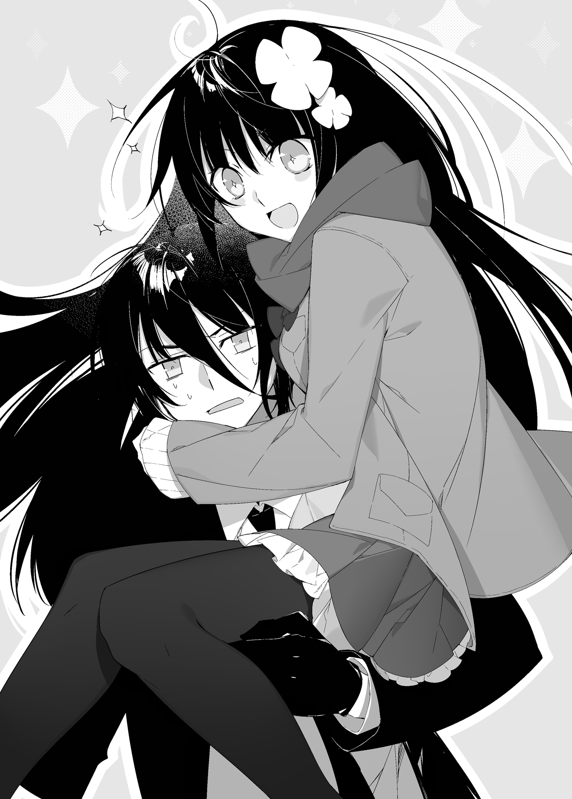

Nhưng gạt chuyện của Io Kuzami sang một bên, Reiji và Suimei không thể lơ là cảnh giác vào lúc này.

Họ quay lại tập trung vào đối thủ của mình, nhưng ngay khi cả hai chuẩn bị chuyển sang thế tấn công, một thứ gì đó từ trên cao bỗng lao bổ xuống. Một chấn động dữ dội chạy dọc mặt đất và một đám mây bụi đất khổng lồ cuồn cuộn bốc lên giữa sân trong. Cảnh tượng tựa như một tòa nhà vừa đổ sụp. Khi màn bụi mù mịt đang nhanh chóng lan rộng đe dọa nuốt chửng lấy họ, Suimei và Reiji lập tức thoăn thoắt nhảy lùi lại phía sau.

"Tch... Lại cái gì nữa đây?"

"Hình như có thứ gì đó rất lớn vừa rơi từ trên cao xuống thì phải..."

Giọng Reiji nghe không hoàn toàn chắc chắn; cậu chỉ kịp thoáng bắt được hình ảnh của nó nhờ thị lực động học đã được cường hóa của mình. Dẫu vậy, làn khói bụi cũng chẳng mấy chốc tan đi, để lộ ra thứ vừa đáp xuống giữa họ và Hadorious.

"Này, này chứ..."

"Đó là..."

"Ồ hô?"

Suimei, Reiji và Io Kuzami đều đồng thanh thốt lên trong sự ngạc nhiên tột độ.

Bởi lẽ thứ vừa hiện ra trước mắt họ mang hình dáng của một người đàn ông khổng lồ, nhưng lại được tạo nên từ thứ đất bùn mài nhẵn màu đen tuyền. Đó là một con golem.

Tính tổng thể, nó cao khoảng chừng năm đến sáu mét. Phần thắt lưng không có phân giới rõ ràng, nhưng các ngón tay trên mỗi bàn tay lại cử động rất linh hoạt và rõ nét. Nó được bao bọc trong luồng ma lực đậm đặc đến mức tỏa ra ánh sáng đỏ rực có thể nhìn thấy bằng mắt thường. Và rõ ràng luồng ma lực ấy vô cùng mạnh mẽ, bởi chính nó là thứ đang gắn kết toàn bộ cơ thể khổng lồ đó lại với nhau.

"Là do công tước làm sao? Không..."

Dường như không phải vậy. Hadorious trông cũng hoang mang không kém trước sự xuất hiện đường đột này, và ông ta đang ngước nhìn lên nóc nhà. Hơn nữa, con golem này trông chẳng hề giống bất kỳ con golem nào mà Suimei từng thấy ở thế giới này từ trước tới nay, điều đó có nghĩa là...

"Hóa ra là như vậy sao?"

Mọi phỏng đoán ấp ủ bấy lâu trong tâm trí Suimei lúc này đã thành hình. Giờ đây cậu chắc chắn một điều rằng Hadorious bắt cóc Elliot là vì ông ta có mối liên hệ mật thiết nào đó với bọn chúng. Hiểu thấu điều đó, Suimei khẽ nhếch mép cười khẩy rồi phủi bụi trên người. Trong khi đó, Reiji đã dũng cảm lao vọt về phía trước.

"Chỉ là một tên khổng lồ bằng bùn đất thôi sao?"

"Này, khoan đã, Reiji! Bình tĩnh lại đi! Đừng có hấp tấp!"

Reiji chỉ đơn thuần cho rằng con golem sẽ là một đối thủ dễ xơi, và đó quả thực là một cái bẫy rất dễ sập vào. Nếu nó chỉ là một con rối tự động (automaton) làm bằng đất thông thường, chắc chắn nó không thể chống đỡ nổi thanh kiếm orichalcum mang sức mạnh Nữ thần của Reiji. Cậu hoàn toàn có thể chém phăng nó làm đôi—dẫu sao thì đó là nếu nó là một con golem của thế giới này.

Thế nhưng lời cảnh báo của Suimei đã đến muộn mất một nhịp để ngăn đòn tấn công của Reiji nhắm vào gã khổng lồ. Cậu vung kiếm chém tới bằng tất cả sức mạnh của mình, nhưng nhát chém chẳng hề phát ra bất kỳ âm thanh nào. Trên thực tế, Reiji thậm chí còn không có cảm giác là mình vừa chém trúng bất cứ thứ gì.

"Không có cảm giác... Ư!"

Tựa như đang xua đuổi một con muỗi phiền toái, con golem lãnh đạm vung cánh tay của nó. Reiji lập tức nhảy dạt sang bên để né tránh.

Nhát đập hụt của cánh tay golem nện thẳng xuống mặt đất tạo ra một chấn động kinh hoàng, khiến ruột gan mọi người rung lên bần bật tựa như tiếng sấm rền từ đằng xa. Kéo theo sau đó là một làn bụi đất và sỏi đá bị hất tung lên không trung.

Reiji liền hành động dứt khoát mà không hề lộ chút sợ hãi. Nhắm vào cánh tay chậm chạp của con golem—phán đoán rằng các khớp nối của nó sẽ là mục tiêu dễ tổn thương nhất—cậu vung kiếm một cách táo bạo, thế nhưng...

"C-Cũng không có tác dụng sao?! Chuyện quái gì đang xảy ra thế này?!"

Y hệt như trước, con golem hoàn toàn không hề hấn gì trước thanh kiếm của Reiji. Y hệt như trước, nó đáp trả bằng cách quơ cánh tay như thể đang xua đuổi một con côn trùng. Và cũng y hệt như trước, Reiji dễ dàng né tránh chuyển động lờ đờ uể oải đó với một khoảng cách an toàn. Nếu cứ tiếp diễn thế này, đây sẽ là một đối thủ vô cùng khó nhằn để hạ gục.

Khi giao chiến với một con rối tự động, phương thức tiêu chuẩn luôn là đánh bại chủ nhân điều khiển nó. Dẫu vậy, xung quanh chẳng hề có lấy một dấu vết nào của kẻ điều khiển. Kẻ đó dường như không phải là Hadorious, nên tấn công ông ta cũng vô ích. Hơn nữa, nếu họ cố làm vậy, con golem chắc chắn sẽ che chắn cho ông ta. Trông nó như thể là đồng minh của vị công tước vậy.

Đã như vậy, Suimei xác định ưu tiên hàng đầu lúc này là phải hạ gục con golem kiên cố hơn nhiều so với vẻ ngoài này. Cậu toan ra tay, nhưng đúng lúc đó, Io Kuzami liền bước lên trước mặt cậu, khoanh tay đầy kiêu dũng với chiếc khăn quàng cổ màu đỏ tung bay trong gió.

"Đã đến lúc để ta ra tay— Hở?"

Vừa hiên ngang bước lên phía trước để hỗ trợ đồng đội, Io Kuzami bỗng nhiên co rúm người lại ngay tại chỗ.

"Này, có chuyện gì thế?!"

Cô bé đang run rẩy. Rõ ràng là vừa có chuyện gì đó xảy ra. Nhận thấy cô đang ở vị trí nguy hiểm, Suimei lập tức lao đến bên cạnh. Nhưng khi cậu vừa tới nơi, cô liền đứng dậy...

"...Hở? Gì cơ?"

Bằng tông giọng nghe giống hệt một Mizuki đang bối rối, cô bắt đầu nhìn quanh quất với vẻ mặt hoang mang tột độ. Thấy vậy, Reiji vừa liên tục né đòn của con golem vừa cất tiếng gọi cô.

"Io Kuzami-san? Chuyện gì—"

"CÁI GÌ CƠ?! Reiji-kun, sao cậu lại có thể như thế hả?! Cậu biết là cậu tuyệt đối không bao giờ được phép gọi tớ như thế, dù chỉ là đùa giỡn mà! Cậu biết rõ điều đó đúng không?!"

"H-Hở? Chẳng lẽ là... Mizuki? Là cậu thật sao, Mizuki?"

"Cậu nói cái gì thế? Đương nhiên là tớ rồi! Quan trọng hơn, chúng ta đang ở đâu đây? Chẳng phải chúng ta đang ở trong một hang động ở Liên minh sao...?"

Có vẻ như Anou Mizuki rốt cuộc cũng đã trở lại, và cô bé đã chọn đúng một sân khấu không thể náo nhiệt hơn. Thế nhưng... rốt cuộc chuyện gì đã xảy ra với Io Kuzami? Reiji thì bối rối đến nghẹn lời, Mizuki thì hoàn toàn ngơ ngác, còn Suimei thì sững sờ đến câm nín.

"Mizuki, cậu canh đúng cái thời điểm chết tiệt nào để quay lại thế hả?! Khoan đã, chẳng lẽ đây là đòn trả thù cho những gì tôi vừa nói sao?! Tính cách của ngươi tà ác quá mức rồi đấy, con tinh linh thần bí kia!"

Suimei gào lên, nhưng lời mắng mỏ của cậu chẳng thể chạm tới Io Kuzami, người dường như đã biến mất dạng. Tuy nhiên, Mizuki lại nghe thấy rành rọt từng chữ một.

"Này, hai cậu tự dưng bị làm sao thế hả?! Sao lại nói về tớ như thế chứ?! Khoan đã, tại sao Suimei-kun lại ở đây cơ chứ?! Lại còn mặc cả âu phục nữa chứ... Cơ mà, bộ vest kèm áo măng tô dài này trông ngầu thật đấy..."

Đúng như dự đoán, bộ âu phục màu đen của Suimei đã gãi đúng chỗ ngứa trong tâm hồn chuunibyou của Mizuki. Cô bé ngắm nhìn cậu với ánh mắt đầy thích thú trước khi một thứ gì đó vô cùng to lớn thu hút sự chú ý của cô. Thứ đó, dĩ nhiên, không ai khác ngoài con golem.

"C-Cái gì...?"

Khoảnh khắc hoang mang không dám tin diễn ra. Đầu óc cô bé chưa kịp tiếp thu thứ khổng lồ sừng sững trước mặt, khiến cô cứng đờ người trong chốc lát trước khi lại trở nên vô cùng phấn khích.

"Hở? Đ-Đ-Đây là một con golem! Chuyện gì đang xảy ra thế này? Thật sự luôn đấy, cái gì cơ?! Thứ này là gì vậy?! Suimei-kun, giải thích đi!"

"Tớ sẽ giải thích, nhưng để sau! Giờ thì im lặng và trật tự giùm cái! Với lại mau tránh đường và lùi ra sau đi!"

"T-Tớ cũng muốn lắm, nhưng mà..."

"A, chết tiệt!"

Mizuki vẫn còn đang phần nào bị đông cứng và mất phương hướng. Cô bé hầu như chẳng biết phải quay về hướng nào. Suimei khẽ tặc lưỡi bực bội, nhưng cậu liền dùng bí thuật nhẹ nhàng nhấc bổng cô bé lên và kéo cô về phía mình trước khi ôm trọn cô vào trong vòng tay.

"Oa, cậu khỏe thật đấy, Suimei-kun nhỉ?"

"Ngậm miệng lại đi. Cậu cắn phải lưỡi bây giờ đấy."

Nói xong, Suimei liền tung người nhảy lùi lại một khoảng cách rất xa và chuẩn bị vận dụng bí thuật của mình.

"Reiji, tránh ra mau!"

Sau khi hét lên một tiếng cảnh báo tới Reiji đang mải giao chiến với con golem, Suimei bắt đầu niệm xướng cho một trong những câu chú mạnh nhất của mình.

"O flammae, legito. Pro venefici doloris clamore. Parito colluctatione et aestuato. Deferto impedimentum fatum atrox. Fiamma est lego. Vis Wizard. Hex agon Aestua Sursum. Impedimentum Mors."

*[Hỡi ngọn lửa, hãy tập hợp lại. Như tiếng gào thét oán hận của ma thuật sư. Hãy trao cho nỗi giằng xé của cái chết một hình hài và bùng cháy rực lửa. Giáng xuống kẻ cản bước ta một vận mệnh kinh hoàng. Ngọn lửa đã được hiệu triệu. Sức mạnh của Ma thuật sư. Lục giác bừng cháy. Cái chết dành cho kẻ cản đường.]*

Cùng với câu chú cuối cùng của Suimei, Reiji tung một cú nhảy vọt lùi lại phía sau. Những ma pháp trận rực lửa đã bắt đầu xuất hiện xung quanh con golem. Chúng sáng rực lên chỉ trong chớp mắt, và đột nhiên toàn bộ sân trong của dinh thự Hadorious bừng sáng như thể đang giữa ban trưa.

"Itaque conluceto! O Ashurbanipalis fulgidus lapillus!"

*[Vậy nên hãy tỏa sáng! Hỡi viên ngọc chói lọi của Ashurbanipal!]*

Suimei lập tức kích hoạt từ khóa bí thuật, và ngọn lửa nguyền rủa cuồn cuộn trút xuống nhấn chìm con golem. Chúng phun ra từ các ma pháp trận tựa như những khẩu súng phun lửa, và con golem lập tức bị thiêu đốt ngùn ngụt. Con golem cao đến mức những ngọn lửa liếm tới tận vai nó trông như thể đe dọa thiêu rụi cả bầu trời đêm. Phải mất một hồi lâu ngọn lửa mới chịu dịu dần, nhưng khi chúng tắt hẳn... con golem vẫn sừng sững đứng đó như thể chưa từng có chuyện gì xảy ra. Ngọn lửa của Ashurbanipal vốn dĩ chủ yếu dùng để đối phó với các sinh vật sống, thế nhưng...

"Khốn kiếp! Chẳng có tác dụng gì chút nào ư?! Đừng nói với tôi thứ đó là hàng xịn thực sự đấy nhé?! Chết tiệt, chẳng có ai từng nói là có cái thứ quái quỷ này ở đây cả!"

"C-C-Cái gì cơ?! Tuyệt vời quá đi mất! Suimei-kun vừa mới dùng ma thuật kìa! Ma thuật siêu đỉnh luôn! Cậu học được thứ đó từ khi nào thế hả?! Này, này! Nói cho tớ nghe với—"

"AAAAAAAAH, CHẾT TIỆT! IM MIỆNG LẠI DÙM CÁI COI! Hiện tại tớ đang bận tối tăm mặt mũi đây này, nên làm ơn nghiêm túc trật tự chút đi, được không hả?!"

"Nhưng mà, nhưng mà, nhưng mà—cậu biết đấy, cậu biết không hả?"

"Tớ không biết! Và không có nhưng nhị gì hết!"

Mizuki dường như ngày càng phấn khích hơn trong vòng tay Suimei. Rõ ràng là cậu đã chịu đựng quá đủ rồi, nhưng cô bé chẳng hề có dấu hiệu nào là sẽ chịu bình tĩnh lại. Thậm chí, cô còn nhoẻn miệng cười toe toét và cất tiếng nói tiếp, hoàn toàn bất chấp lệnh cấm khẩu toàn diện mà Suimei vừa ban ra.

"Hi hi hi... Ồ ô, Suimei-kun! Reiji-kun! Có cần tớ chỉ cho điểm yếu của một con golem không nào?"

Người phản ứng đầu tiên là Reiji.

"Cậu biết điểm yếu của thứ này sao, Mizuki?!"

"Đương nhiên rồi! Điểm yếu của golem là kiến thức ma thuật cơ bản của cơ bản luôn đấy, các cậu biết không? Chậc, chậc, chậc..."

Mizuki lắc lắc ngón tay trỏ sang trái sang phải như một trợ lý bác sĩ đang giải thích một điều hiển nhiên.

"Được rồi, nghe cho kỹ đây. Trên trán của con golem chắc chắn sẽ có một tấm bùa khắc chữ 'emet'. Từ đó có nghĩa là 'chân lý', và đó chính là mấu chốt của toàn bộ trò này đấy. Thấy chưa, nếu cậu xóa bỏ chữ cái đầu tiên đi, nó sẽ biến thành 'met', tức là 'cái chết'. Nếu làm được điều đó, con golem sẽ tan biến ngay lập tức! Các cậu nhìn thấy trán của nó rồi đúng không? Tấm bùa nằm ngay ở đó đấy."

Mizuki hăng hái chỉ thẳng ngón tay về phía trước đến mức Suimei cảm thấy dường như nó phải đi kèm với mấy hiệu ứng âm thanh khoa trương rẻ tiền nào đó. Nhưng cô bé nói đúng; trên trán con golem quả thực có dán một thứ gì đó với những ký tự được khắc sâu bên trên. Reiji cũng đã nhận ra điều đó.

"Ra là vậy... Thế thì nếu chúng ta có thể khéo léo chém bay tấm bùa đó..."

"Vô ích thôi. Nhìn kỹ lại đi."

"Hở?"

Khi Suimei thẳng thừng bác bỏ lời gợi ý của Mizuki, Reiji không khỏi hoang mang. Mizuki dường như cũng bối rối không kém khi cô bé nheo mắt nhìn chằm chằm vào trán con golem.

"Nhưng mà, ừm..."

"Hử? Nó khác với những gì Mizuki vừa nói sao? Những ký tự đó là..."

"Đúng thế. Mật ngữ quyền năng (power word) là 'מת–אל'. Tên khốn này vốn chẳng được tạo ra dựa trên bất kỳ điều gì liên quan đến chân lý cả."

"C-Cái gì cơ? Nhưng chẳng phải golem theo truyền thuyết là..."

"Nói sao đây nhỉ...? Có vẻ như cậu đang hiểu lầm tai hại đủ thứ rồi đấy. Thứ mà cậu đang nghĩ đến là chữ 'emet' viết bằng các ký tự chữ cái tiếng Latinh. Còn trong tiếng Hebrew, đúng là nếu cậu đổi 'מת–אל' thành 'מת', thì mật ngữ quyền năng ban đầu sẽ mất đi... ừ thì, mất đi quyền năng của nó. Nhưng cậu thực sự nghĩ có ai lại đi dùng một cái mật khẩu dễ bị hack như thế cho con golem của mình sao?"

Việc chế tạo golem và các câu chú để vận hành chúng vốn được xem là những bí thuật mật truyền. Để có thể tự do sử dụng một trong hai kỹ thuật đó đòi hỏi kỹ năng vô cùng phi thường. Thế nhưng cái mẹo 'emet' cũ rích kia đã quá lỗi thời đến mức ngay cả Mizuki cũng biết tỏng. Dù nói vậy, cốt lõi của ý tưởng đó vẫn có giá trị—vẫn luôn có một mẹo trong cơ chế vận hành của chúng. Tuy nhiên, những người tạo ra golem cùng các loại rối tự động khác sẽ sử dụng đủ mọi thủ đoạn và mánh lới tinh vi để ngăn chúng bị ghi đè hoặc vô hiệu hóa một cách dễ dàng.

Một con golem hoạt động độc lập không có được sự linh hoạt như một con golem được điều khiển trực tiếp bởi thuật sĩ. Chúng hầu như chỉ có thể thực hiện các hành động đã được lập trình sẵn từ trước, và do đó khá là vô dụng khi phải đối đầu với các ma thuật sư. Vì lý do đó, chúng thường chỉ được ban cho các mệnh lệnh chung chung là tấn công hoặc phòng thủ. Và trong trường hợp này, con golem đặc biệt này..."

"V-Vậy những chữ trên con này có nghĩa là gì thế, Suimei-kun?!"

"Như tớ đã nói lúc nãy rồi đấy, nó là 'מת–אל'. Có một dấu gạch nối mà cậu không thấy trong tiếng Anh liên kết hai từ 'Chúa' (God) và 'đã chết' (dead), nên ý nghĩa của nó giống như 'Chúa đã chết' (God is dead). Nó vốn dĩ chưa từng được đặt tên theo chân lý, thế nên ngay cả khi cậu có rút gọn nó lại chỉ còn phần 'cái chết' thôi, nó cũng chẳng mảy may suy suyển gì đâu."

***
[Chapter 3: The Strongest of the Seven - Part 3](./chapter_3_the_strongest_of_the_seven_part_3.md) | [Chapter 3: The Strongest of the Seven - Part 5](./chapter_3_the_strongest_of_the_seven_part_5.md)
