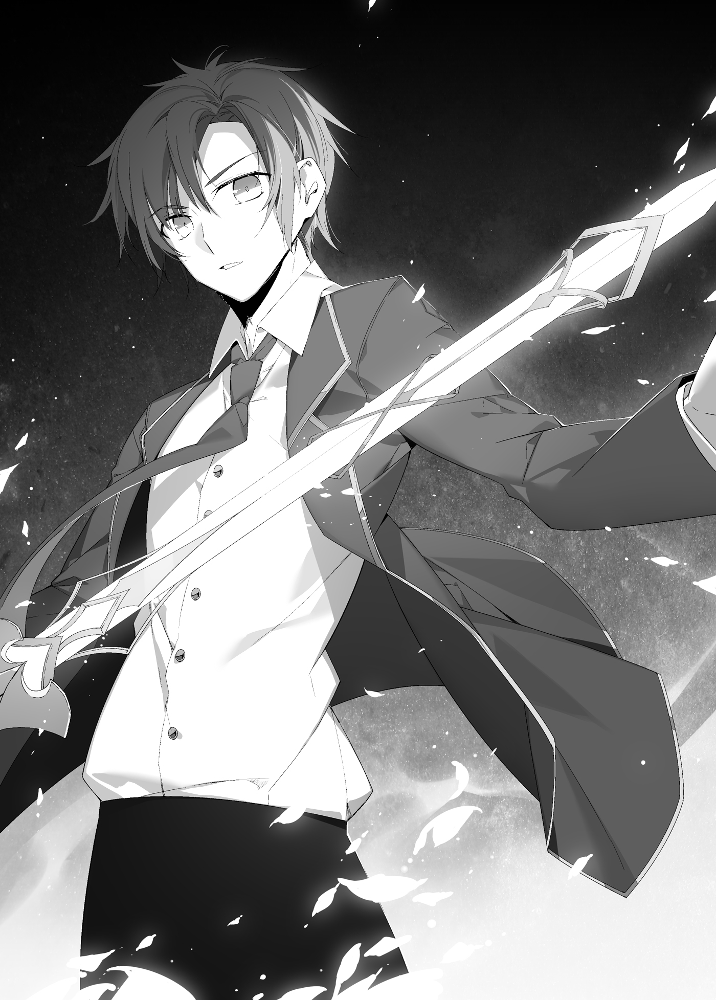

*Chân thành dốc sức tiến về phía trước vì mưu cầu hạnh phúc. Vậy thì... đâu là thứ đối lập phản bác lại tất cả những điều đó? Một ông lão mời gọi giấc ngủ? Hay một đứa trẻ giả vờ làm một con lửng? Một con quái vật thao túng trọng lực? Chẳng có cái nào đúng cả, nhỉ? Thứ đối nghịch với nó theo cách tinh giản nhất có thể chính là—*

*Ressentiment* (oán hận âm ỉ)—thứ được Cơ Đốc giáo tạo ra nhằm hợp thức hóa sự đồng tồn tại của Thượng đế và giới giàu sang phú quý. Đó là quan niệm về thứ hạnh phúc giả tạo được gán cho người nghèo khó, một lời nguyền đem lại quyền lợi cố hữu cho đại chúng. Nietzsche từng nói về nó như sự nghiến răng nghiến lợi trong nỗi bất lực khôn cùng, lời nguyền rủa của xã hội. Con người ta sẽ tự dằn vặt chính mình vì sự bất bình đẳng cho đến ngày nhắm mắt xuôi tay; đó là một dạng oán hận sâu sắc đến khó tin. Đó cũng chính là thứ đe dọa tư tưởng của Nietzsche nhiều nhất.

Đó chính là câu trả lời, nhưng xem chừng vẫn còn quá yếu ớt. Chừng nào khái niệm *ressentiment* chưa từng tồn tại ở thế giới này, Suimei sẽ chẳng thể nào dễ dàng khơi gợi nó ra, và nó cũng sẽ không đi kèm với nhiều sức mạnh. Dẫu vậy, vẫn có một thứ tương đồng rất phù hợp. Đúng vậy, sự oán hận và ghen tị dồn nén của thế giới này mà những kẻ sa đọa cuồng tín từng sử dụng...

"Liliana... tôi xin phép mượn tạm ma pháp của cô nhé."

Nói ngắn gọn, đó chính là hắc ma pháp (dark magic). Từng bị Liliana cùng các pháp sư của thế giới này hiểu lầm là một Tinh linh (Element), đó thực chất là một loại bí thuật tận dụng thể tích tụ của ác niệm và oán khí. Dưới tư cách là người hướng dẫn từng bảo Liliana không được sử dụng nó, việc Suimei nhúng tay vào thứ ma pháp này quả thực là đang nêu một tấm gương xấu, nhưng đây là trường hợp đặc biệt.

Sau một hồi Suimei lầm bầm một mình, bạn bè cậu bắt đầu cảm thấy lo lắng trước sự im lặng đột ngột của cậu.

"Suimei?"

"...Ừ, tớ đã sắp xếp xong suy nghĩ trong đầu rồi. Reiji, tớ sẽ chuẩn bị thuật thức để vô hiệu hóa tính bất khả chiến bại của con golem. Cậu hãy ra ngoài kia và đảm bảo rằng mình có thể tung ra một đòn dứt điểm chuẩn xác. Tớ muốn cậu di chuyển xung quanh và quấy rối cầm chân nó. Rõ chưa?"

Một lần nữa dùng cành cây làm thước chỉ bảng, Suimei vung mạnh cành cây chĩa thẳng về phía Reiji dứt khoát. Và Reiji gật đầu đáp lại.

"Ừm. Nếu chỉ là di chuyển xung quanh thì tớ lo được. Nó khá chậm chạp và rất dễ đoán hướng di chuyển."

"Tốt. Tạm thời, tớ sẽ bắt đầu bắn ra một vài bí thuật để khiến bọn chúng nghĩ rằng chúng ta đang rơi vào thế tuyệt vọng. Tình hình có lẽ sẽ hơi hỗn loạn một chút đấy..."

"K-Khoan đã nào! Cái kiểu kế hoạch gì thế này chứ?! Cậu bảo là cậu sẽ chuẩn bị một câu thần chú, nhưng cậu thực sự vẫn chưa chỉ cho Reiji-kun biết cậu ấy cần phải làm những gì mà?"

"Cần phải thế sao? Nếu thuật thức phát huy tác dụng, nó sẽ không còn bất khả chiến bại nữa."

"Đúng vậy. Còn nếu nó không có tác dụng, chúng ta chỉ việc nghĩ cách khác thôi."

"D-Dù vậy thì..."

Mizuki dường như vẫn còn ngần ngại chưa yên tâm, và Suimei cất tiếng như thể đã nhìn thấu những gì cô bé đang nghĩ trong đầu.

"Cậu biết đấy, Mizuki, chính xác thì tớ sẽ đạt được điều gì bằng cách chỉ đạo tỉ mỉ cho Reiji phải làm gì chứ? Cậu muốn tớ phải tường thuật từng bước một cách chặt chém đối thủ cho cậu ấy nghe chắc?"

"Thế thì hơi khó đấy... Tớ chỉ mong là cậu cứ để tớ tự do tùy cơ ứng biến thôi."

"Được rồi, đành vậy... Con trai các cậu lúc nào cũng thế cả."

Mizuki thở dài một tiếng vừa kinh ngạc vừa chịu thua sau khi nghe màn đối đáp của hai người họ, nhưng trông cô bé đã an tâm hơn nhiều. Thực sự mà nói, đây chẳng phải là điều gì đáng để kinh ngạc. Bất cứ khi nào họ gặp phải rắc rối ở thế giới cũ trước kia, đây về cơ bản chính là chiến thuật thoải mái, phóng khoáng mà họ thường áp dụng. Và theo như Suimei nhận định, họ đã dành đủ thời gian cho việc bàn bạc chiến thuật rồi. Cậu thò đầu ra khỏi chỗ nấp và liếc nhìn về phía Hadorious.

"Đúng như tớ dự đoán, có vẻ như vị công tước kia không có ý định cử động."

"Ông ta nói rằng ông ta đang thử thách tớ, nên tớ không nghĩ ông ta thực sự có ý định hãm hại bọn mình đâu. Giờ con golem này đã xuất hiện như một công cụ đo lường mới, tớ cá là ông ta sẽ không ra tay cho đến khi nó bị đánh bại."

Nghe thấy vậy, Suimei bẻ đôi cành cây đang cầm trên tay cái rắc.

"Được rồi, mau chóng hạ gục nó trong nháy mắt rồi đấm thẳng vào mặt ông ta thôi. Hai phát."

"Được, nghe hay đấy."

"Cuộc họp chiến thuật kết thúc."

"Vậy tớ đi đây. Suimei, tớ trông cậy vào thuật thức của cậu đấy. Nếu nó không có tác dụng, cậu nợ tớ một lần đấy nhé."

"Cứ để đó cho tớ."

Nghe thấy lời đáp đầy tự tin của Suimei, Reiji liền nhảy ra khỏi chỗ nấp và lao thẳng về phía con golem theo đúng kế hoạch. Dõi theo bóng lưng cậu, Suimei cũng bắn ra một tia chớp bí thuật về phía nó, nhưng tuyệt nhiên không hề cất tiếng cảnh báo nào cho Reiji. Và Reiji cũng chẳng một lần ngoái đầu nhìn lại. Chẳng hề có nhu cầu làm điều đó—họ tin tưởng nhau tuyệt đối.

Sau tất cả những gì đã cùng nhau trải qua, họ chính là những người anh em vào sinh ra tử trên chiến trường.

*Nếu là Suimei, dù cậu ấy là một tên lập dị hay hoài nghi châm biếm đi chăng nữa, một khi đã đưa ra quyết định, cậu ấy sẽ dốc toàn lực thực hiện đến cùng. Thế nên nếu cậu ấy là người yểm trợ cho mình, mình biết chắc cậu ấy sẽ luôn bọc lót phía sau lưng.*

*Nếu là Reiji, một khi đã đặt niềm tin vào ai đó, niềm tin ấy là tuyệt đối. Cậu ấy sẽ không bao giờ nghi ngờ hay dao động, và đó là lý do tại sao cậu ấy sẽ không ngoái đầu nhìn lại... Cậu ấy sẽ chỉ đơn giản là tiếp tục tin tưởng vào mình và dũng mãnh tiến về phía trước.*

Chính mối liên kết gắn bó sâu sắc mà họ sẻ chia sẽ mang lại cho họ thế thượng phong nơi đây.

Reiji đang dắt mũi con golem chạy vòng quanh, trong khi Suimei liên tục dùng bí thuật để làm chậm bước tiến của nó. Mặt khác, Hadorious hoàn toàn chẳng làm gì cả. Gã đàn ông ảo ảnh có lẽ đang ở đâu đó quanh đây, nhưng dường như cũng chẳng có động tĩnh gì. Phải chăng là vì bọn chúng thực sự nghĩ rằng nhóm Suimei đang rơi vào thế đường cùng tuyệt vọng? Khi con golem ngày càng trở nên chậm chạp hơn, có vẻ như cục diện bắt đầu nghiêng dần về phía có lợi cho họ.

Và với sự tin tưởng tuyệt đối giữa Suimei và Reiji, chẳng hề tồn tại bất kỳ sơ hở nào trong sự phối hợp ăn ý của họ. Họ hành động với sự nhịp nhàng hoàn hảo như thể đã lên kế hoạch cho toàn bộ mọi chuyện từ trước, cùng nhau hướng tới một mục tiêu chung. Sẽ chẳng có thứ gì có thể ngăn cản được họ chừng nào họ còn duy trì mối liên kết ấy.

"Golem, một trong những nghệ thuật tối cao của Kabbalah... Ban đầu nó là một con người nhân tạo được tạo ra bởi một giáo sĩ rabbi. Nó là một thực thể trung thành tuân theo mọi mệnh lệnh của người sáng tạo ra nó, kết quả từ những dục vọng vô tận của con người... Và để thỏa mãn mong muốn của chủ nhân ngươi, ngươi được tạo ra với vẻ ngoài hoàn hảo— Không, để thử thách sức mạnh và tri thức của bọn ta, ngươi là hiện thân cho những tư tưởng của Nietzsche."

Không cần ai khơi gợi, Suimei bắt đầu giải mã sự tồn tại của con golem này. Cứ như thể cậu đang củng cố những ý niệm của chính mình, bồi đắp nền tảng vững chắc cho hiện tượng huyền bí sắp sửa diễn ra.

"Chúa đã chết... Những lời nói thốt ra từ một giấc mộng—cho đến tận ngày nay, những lời ấy đã được diễn giải theo mọi cách có thể. Chúng khẳng định ý chí tự do của con người và phủ nhận tội lỗi của họ. Nền tảng của nó nằm ở việc kiềm tỏa những quyền lợi cố hữu ngày càng phình to, và đó là một bước đi vững chắc trong việc dẫn dắt nhân loại bước đi trên một con đường mới. Và thứ đẩy điều đó lên đỉnh điểm chính là tư tưởng vĩ đại được Cơ Đốc giáo chủ xướng. Thứ sinh ra nhằm khích lệ kẻ yếu, và khiến họ oán hận kẻ mạnh—phải, chính là *ressentiment*."

Đúng vậy, những gì Cơ Đốc giáo liên tục khắc sâu vào tâm trí quần chúng chính xác là điều đó. Họ đã lợi dụng sự bất mãn của người nghèo để chứng thực cho sự tồn tại của Thiên Chúa.

"Con lạc đà chui qua lỗ kim còn dễ hơn người giàu bước vào Nước Thiên Chúa." Kẻ mạnh xuống địa ngục và kẻ yếu lên thiên đàng. Cùng một tư tưởng ấy đã được sử dụng để hợp thức hóa sự chênh lệch giàu nghèo. Nghèo khó là chính nghĩa. Là thanh cao danh giá. Và theo nghĩa đó, Cơ Đốc giáo giảng dạy về sự công chính tối thượng.

Nghe thì có vẻ êm tai khi dùng nó để an ủi và khích lệ người nghèo, nhưng thực chất nó chẳng qua chỉ là một phương tiện nhằm dập tắt bất kỳ cuộc nổi dậy nào đe dọa đến những quyền lợi cố hữu. Cứ việc oán hận người giàu, nhưng hãy cứ an phận chịu nghèo trong thanh cao. Điều đó sẽ giúp ngươi bước chân vào thiên đàng, và ở nơi đó cuối cùng ngươi có thể từ trên cao nhìn xuống cười nhạo những kẻ giàu có đang chịu đọa đày dưới hỏa ngục. Và cứ thế, người nghèo sẽ mãi mãi nghèo khó cho đến tận lúc chết. Nietzsche đã tuyệt vọng trước ý nghĩ đó. Ông hiểu rằng sống trên cõi đời này đồng nghĩa với những nỗi thống khổ khôn cùng như vậy, và để vượt qua điều đó, ông tuyên bố rằng Chúa đã chết. Sự nghèo khó thanh cao sẽ chẳng bao giờ mang lại hạnh phúc cho người nghèo. Nếu sự nhọc nhằn của những kẻ làm việc cật lực đến kiệt sức không được công nhận, thì bản thân họ cũng sẽ vĩnh viễn không bao giờ được thừa nhận. Và vì vậy, ông đã phủ nhận những giá trị Cơ Đốc giáo truyền thống của thế giới phương Tây.

Trong trường hợp đó, chính ý niệm về *ressentiment* là mặt đối lập trực tiếp với phương pháp của ông. Ác niệm, đố kỵ, thù hận, và thứ hắc ma pháp được tạo nên từ chúng sẽ là kẻ thù khắc tinh của con golem này. Nếu nền tảng của hắc ma pháp là những cảm xúc cay đắng u uất của thế gian, thì sự đố kỵ ghen ghét của kẻ yếu đối với kẻ mạnh chắc chắn cũng sẽ nằm trong số đó.

"Hãy đến đây, hãy đến đây, đi theo ta. Hãy lấy giọng nói báng bổ của ta làm người dẫn đường soi lối cho các ngươi. Hỡi những ý chí cuộn xoáy và trào dâng mà cả thế gian này đều kinh tởm ghét bỏ..."

Sau khi nhanh chóng bố trí một trận pháp phòng ngự dưới chân Mizuki, Suimei một lần nữa giải phóng ma lực để gia tăng hiệu quả của bí thuật, tạm thời nâng cấp thứ hạng của mình. Vẽ một ngôi sao năm cánh ngược với bàn tay duỗi thẳng cứng cáp như lưỡi đao, lượng ma lực vốn tràn ngập xung quanh cậu lập tức bị ngấu nghiến bởi luồng ác niệm vừa được thức tỉnh. Nó chuyển sang màu đen kịt thẫm hơn cả màn đêm lúc nửa đêm, và từ bức màn đen tối của sự tuyệt vọng ấy, càng nhiều bóng tối sủi bọt cuồn cuộn trào ra.

Những bọt khí hắc ám đó chính là sự biểu hiện rõ ràng, tinh khiết nhất của ác niệm. Chúng là lực lượng huyền bí đằng sau hắc ma pháp, và khi ngày càng có nhiều bọt khí xuất hiện, những tiếng thì thầm u ám bắt đầu cuộn xoáy khắp không gian.

Những giọng nói đó là... Đó là những tiếng thét the thé của một người phụ nữ đang gào thét sự cay đắng oán hờn của mình. Giọng nói khàn đặc của một ông lão bị thiêu đốt bởi lòng đố kỵ. Giọng nói ồm ồm thô tục của một người đàn ông vĩnh viễn chìm đắm trong mối hận thù sâu sắc. Tiếng khóc hờn dỗi ré lên của một đứa trẻ sơ sinh.

Tấn công dồn dập vào màng nhĩ của tất cả mọi người, dòng thác âm thanh chói tai hỗn loạn xuyên thẳng vào não bộ họ, vang vọng đinh tai và biến sân trong dinh thự của Hadorious thành một phòng hòa nhạc ảm đạm, ghê rợn. Khi luồng tà ác hữu hình đó ập xuống bao trùm xung quanh Reiji, cậu rốt cuộc không kìm được mà gọi lớn về phía Suimei với vẻ cấp bách.

"S-Suimei! Tớ biết là cậu có ý tốt, nhưng thế này thì hơi quá đà rồi đấy!"

"Ráng chịu đựng đi! Nếu không làm đến mức này thì sẽ chẳng có tác dụng gì đâu! Cậu có sự bảo hộ thần thánh của Nữ thần hay gì gì đó cơ mà, nên tớ khá chắc là cậu sẽ ổn thôi!"

"Cậu 'khá chắc' á?! Sẽ chẳng vui vẻ gì đâu nếu cậu đánh gục luôn đồng minh trước khi hạ gục kẻ thù đâu, chết tiệt!"

Quả đúng như dự đoán, ngay cả Reiji cũng cảm thấy kinh hãi trước những gì Suimei đang làm. Nhưng trong khi cậu vẫn tiếp tục cằn nhằn than phiền...

"Hỡi Bóng Tối. Ngươi là sắc đen phù du tô điểm thế giới này rộng khắp. Hòa trộn vào sự tráng lệ, biến đổi tất cả thành sự điềm gở, và vặt đi những mầm mống của số phận. Eva, Zurdick, Rozeia, Deivikusd, Reianima..."

Và rồi những từ khóa xuất hiện, ca tụng sự tuyệt vọng như một bài điếu văn...

"Ảo Vọng Phù Du (Transient Hope)."

Thứ mà Suimei sử dụng để phá vỡ tính bất khả chiến bại của con golem chính là hắc ma pháp mà Liliana từng dùng trước đây. Và bằng chính thuật hùng biện cùng những hung danh tàn bạo của riêng mình, cậu đã cường hóa uy lực của nó lên gấp bội.

Bóng tối khi ấy sủi bọt dày đặc đến mức lấp kín cả không gian. Những bọt khí sau đó ngoặt hướng đột ngột và đồng loạt ập về phía con golem. Và đúng như Suimei đã tính toán, từng bọt khí một xuyên thẳng vào cơ thể con golem. Cứ như thể chỗ đứng của nó đột nhiên trở nên chao đảo, con golem bất thình lình rung chuyển dữ dội khi nó loạng choạng bước đi. Thấy vậy, Suimei liền hét lớn về phía người bạn thân đang giao chiến với con rối tự động.

"Được rồi đấy! Ngay bây giờ, Reiji!"

"Rõ!"

Reiji hét lớn đáp lại đầy tự tin, và rồi...

"HAAAAAAAAH!"

Tiếng thét xung trận xé toạc không gian của Reiji vang vọng khắp sân trong. Giương thanh kiếm trong tư thế sẵn sàng như thể chuẩn bị bắn một khẩu súng trường và hạ thấp lưng xuống, cậu gầm lên một tiếng vang dội. Cứ như thể cậu đang giải phóng ý chí chiến đấu cuồn cuộn hay ma lực ngút trời. Rồi cậu bỗng rơi vào tĩnh lặng và âm thầm đâm xuyên cơ thể con golem bằng thanh kiếm orichalcum rực sáng của mình.

"—!"

Lúc này cậu chỉ còn gầm thét trong thâm tâm khi trảm sát kẻ thù của mình. Sau khi chém đứt cánh tay đang quờ quạng trong tuyệt vọng của nó chỉ bằng một nhát kiếm duy nhất, thanh kiếm của cậu đâm xuyên qua vòm ngực khổng lồ của con golem. Nó cắm sâu vào vị trí mà cậu phỏng đoán chính là lõi của con golem.

"RAAAAAAAAH!"

Reiji sau đó gầm lên một tiếng nữa khi cậu đâm thanh kiếm của mình vào sâu hơn nữa. Con golem quằn quại vặn vẹo và cố gắng lao về phía Reiji bằng cánh tay còn lại, nhưng Reiji dồn toàn bộ sức lực mình có vào việc triệt hạ con quái thú cơ khí và hoàn toàn chẳng bận tâm đến nó.

"S-Suimei-kun, c-còn việc yểm trợ cho cậu ấy thì sao...?"

"Không cần đâu. Nếu bây giờ tớ bắn ra một ma pháp, điều đó sẽ rất nguy hiểm cho Reiji. Vả lại, người duy nhất có thể kết liễu thứ đó chỉ có thể là Reiji thôi."

"Chỉ có mỗi Reiji-kun thôi sao...?"

"Đúng vậy. Những kẻ phủ nhận Nietzsche rốt cuộc lại chính là những thần tượng của Thiên Chúa. Xét cho cùng, sự chú ý của Nietzsche vốn dĩ luôn bị giam cầm bởi Thượng đế mà thôi. Và vì Reiji mang theo phước lành thần thánh, cậu ấy đại loại chính là hiện thân của điều đó."

Quả thực, Reiji mang trong mình phước lành thần thánh của Nữ thần Alshuna. Cậu nắm giữ một phần quyền năng của Người, thứ thách thức trực tiếp ý niệm cho rằng thần tính đã chết. Ngay cả ở thế giới này, may mắn và bất hạnh của con người vẫn được định đoạt bởi một đấng tối cao bề trên. Dù là Thần hay Nữ thần, thực chất cũng chẳng có gì khác biệt.

***
[Chapter 3: The Strongest of the Seven - Part 5](./chapter_3_the_strongest_of_the_seven_part_5.md) | [Chapter 3: The Strongest of the Seven - Part 7](./chapter_3_the_strongest_of_the_seven_part_7.md)
